= Project 3B - Ray Tracing 2: Triangles & Recursion
:author: Aaron Glick (glick094)
:docdate: 2025-10-31
:description: CSCI 5607 - Computer Graphics 1
:source-highlighter: pygments
:stem: latexmath
:toc: left
:toclevels: 4
:revdate: 2025-10-31
:nofooter:
:sectnum

// Aaron Glick - glick094
CSCI 5607 (Fall 2025)

Note, I've tried to set up this document both in terms of simplicity to understand my ray tracer implementation, but also make it easy to grade. 

To make grading easy, at the top of this document, I've included the checklist of requirements, features, and extra credit I completed for the project. Each has check box showing it is complete, and a link to that section of the report. 

The body of the document walks through the ray tracer as if I were to explain it to someone. I first explain 

== Grading
=== Requirements

// It will be worth 85/100 points to get these basics features:

* [x] Arbitrary <<camera-pos, camera placement>>, <<film-resolution, film resolution>>, and <<camera-fov-ha, aspect ratio>>
* [x] Arbitrary scenes with <<spheres, spheres>>, <<triangles, triangles-no-normals>> (both without and <<triangles-with-normals, with vertex normals>>), and arbitrary <<background-colors, background colors>>
* [x] Arbitrary <<materials, materials>>, including <<diffuse-lighting, diffuse>> and <<specular-lighting, specular>> shading, <<reflections, reflections>>, and <<refractions, refractions>>
* [x] <<point-lights, Point>> and <<directional-lights, directional lights>>
* [x] <<ambient-light, Ambient lighting>>
* [x] <<shadows, Shadows>>
* [x] Recursion to a <<max-depth, bounded depth>>

=== Additional Features: 

* [x] (5) <<procedural-texturing, Procedural texturing>> or normal mapping (checkerboard, wood, marble, mandelbrot set, etc..)
* [x] (10) <<parallelization, Parallelize>> the raytracer (and analyze the performance gains as you add more processors!)

=== Extra credit

* [x] (5) <<csg, Constructive Solid Geometry>> (<<csg-union, union>>, <<csg-diff, difference>>, and <<csg-intersect, intersection>> of primitives)
* [x] (10) An acceleration structure: <<bvh, BVH>>, BSP, OctTree, etc. (measure the performance impact on different scenes!)
// * [ ] (5) Adaptive supersampling (must show a speedup over non-adaptive)
// * [ ] (5) Texture mapping
// * [ ] (5) User interface that shows the raytraced image being updated
* [x] (25) Ray trace (transformed) <<implicit-surfaces, implicit surfaces>> with <<ray-marching, ray-marching>> (https://rb.gy/o0sefm)
// * [ ] (?) Spectral rendering to separate wavelengths of light

// === Additional Features:
// The number in front is how many points a feature is worth. There will be partial credit for features that “sort of” work.

// // complete an additional 15 points of work to receive full credit
// // turn in up to 40 points worth of additional features to be graded as extra credit, but only at half the value

// *Scene specifications / Primitives:*

// * [ ] (5) Cones and Cylinders
// * [ ] (5) Boxes and Planes
// * [x] (5) Constructive Solid Geometry (union, difference, and intersection of primitives)
// * [ ] (10) Transformations on basic primitives (support 4x4 transformations or procedural ones! http://bit.ly/1vO4tnl)
// * [ ] (20) Procedurally generated terrain/heightfields with grid-marching acceleration
// * [ ] (25) Ray trace (transformed) implicit surfaces with ray-marching (https://rb.gy/o0sefm)

// *Complex Lighting*

// * [x] (5) Spot lights
// * [ ] (5) Area lights that produce soft shadows
// * [ ] (5) HDR, Bloom, & Tone mapping
// * [ ] (10) Ambient Occlusion
// * [ ] (20) Image-based lighting (e.g., HDR environment maps)

// *Sampling*

// * [ ] (5) Jittered supersampling
// * [ ] (5) Adaptive supersampling (must show a speedup over non-adaptive)
// * [ ] (5) Motion Blur
// * [ ] (5) Depth of Field
// * [ ] (15) Physically-based camera lens simulation (match the assortment of lens commonly found in real cameras, e.g., https://en.wikipedia.org/wiki/Zoom_lens)

// *Materials*

// * [ ] (5) Texture mapping
// * [ ] (5) Bump or Normal mapping
// * [ ] (5) Procedural texturing or normal mapping (checkerboard, wood, marble, mandelbrot set, etc..)

// *Miscellaneous*

// * [ ] (5) User interface that shows the raytraced image being updated
// * [x] (10) An acceleration structure: BVH, BSP, OctTree, etc. (measure the performance impact on different scenes!)
// * [x] (10) Parallelize the raytracer (and analyze the performance gains as you add more processors!)
// * [ ] (25) Real-time SIMD/GPU Implementation using e.g., CUDA - http://bit.ly/1EplJpd

== Writeup

Overall, I found lots of useful resources online, but in particular I heavily relied on https://gabrielgambetta.com/computer-graphics-from-scratch[Computer Graphics from Scratch] by Gabriel Gambetta, the https://iquilezles.org/articles/[articles] from Inigo Quilez. 

I am going to walk through talking about the ray tracer from the building blocks that allow us to make a complete ray tracer. We first start with the frustum, or the orientation of the camera and the viewport into the screen.

Then we talk about lighting, since we can't have ray tracing without light! So 

=== Frustum

image:https://gabrielgambetta.com/computer-graphics-from-scratch/images/03-camera-orientation.png[orientation of camera, 300]    image:https://gabrielgambetta.com/computer-graphics-from-scratch/images/03-basic-raytracer.png[basics of ray tracing, 300 ]

==== Camera placement, film resolution, and aspect ratio

[#camera-pos, Camera Position]
----
camera_pos: x y z
----

The camera position is set by parsing the `camera_pos` field from the scene file and storing it in the eye variable (from `parse_pga.h`),which serves as the origin point for all primary rays cast into the scene. The camera system uses three bases to define the frustrum: the eye point, a forward direction vector, and an up vector; the camera's right vector is computed via cross product and normalized to ensure orthonormality. 
// (line 649, 651).

.Varying `camera_pos` with (x, y, z) positions listed
[cols="^1,^1,^1"]
|===
|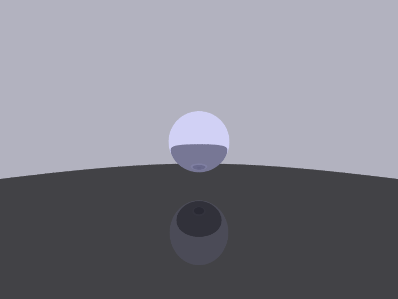 + 
`(0,0,-1)`
|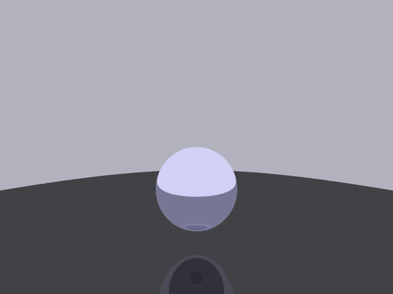 + 
`(0,-1,0)`
|

|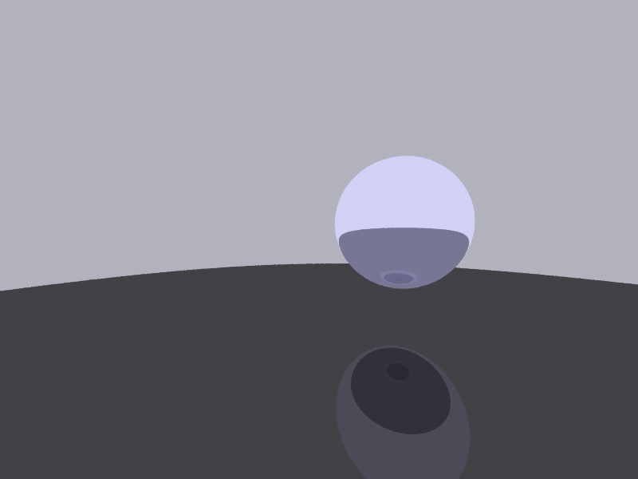 + 
`(-1,0,0)`
|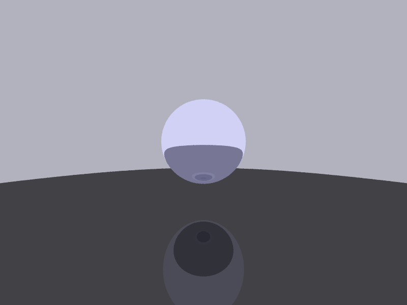 + 
`(0,0,0)`
|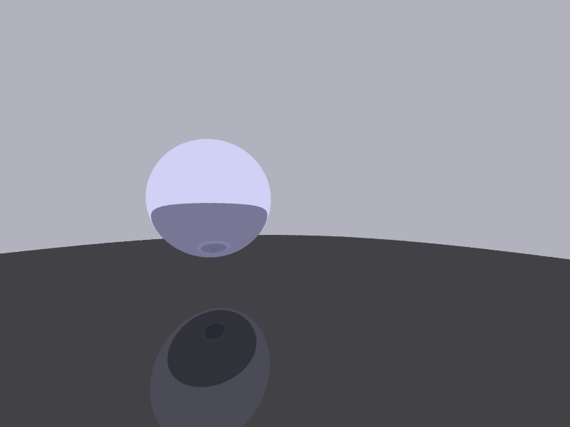 + 
`(1,0,0)`

|
|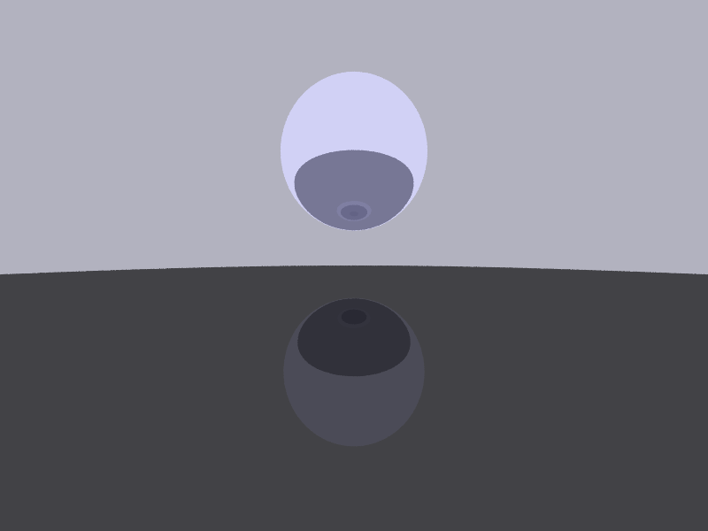 + 
`(0,1,0)`
|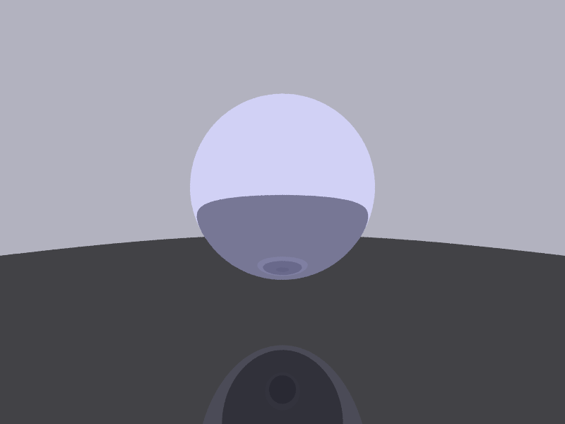 + 
`(0,0,1)`
|===

Clearly, our camera position is working properly. The above were all created with the following camera settings, replacing the specified `camera_pos`. 

----
camera_pos: 0 0 0
camera_fwd: 0 0 -1
camera_up: 0 1 0
camera_fov_ha: 45
----

[#film-resolution, film resolution]
----
film_resolution: width height
----

image:https://gabrielgambetta.com/computer-graphics-from-scratch/images/03-viewport.png[viewport]

Film resolution is specified directly in pixels via the `film_resolution: width height` command, and the aspect ratio is automatically computed from these dimensions. 
// (lines 615-616, 619, 628, 634).
This directly deterimines the overall number rays (up to some repeated sample factor) that we need to shoot, since we need to shoot rays for each pixel on our image plane. 

.Varying `film_resolution` with (width, height) positions listed
[cols="^.^1,^.^1"]
|===
|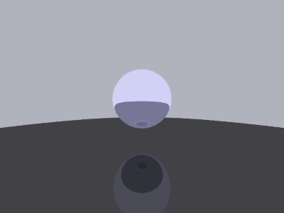 + 
`(400,300)`
|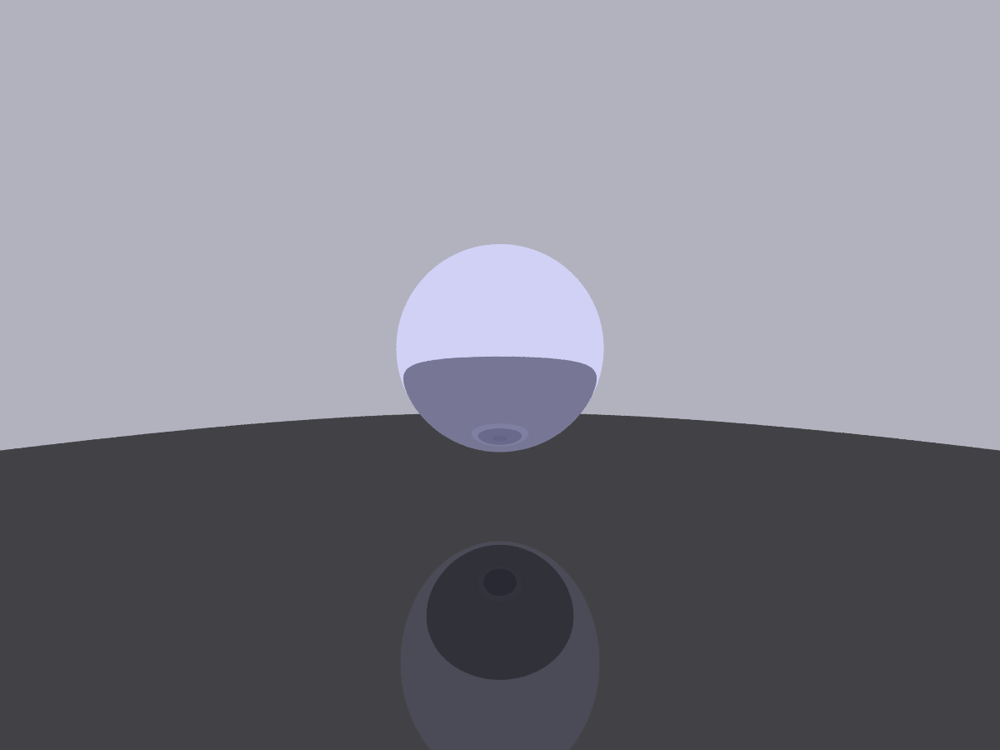 + 
`(1200,900)`
|===

// The vertical field of view (FOV) is specified as a half-angle in degrees using the `camera_fov_ha` parameter, which controls the vertical viewing angle; for a given film resolution and FOV, the horizontal extent of the viewing plane is derived from the aspect ratio, ensuring that pixels map correctly to the ray directions cast into the scene.

[#camera-fov-ha, Camera FOV (HA) aspect ratio]
----
camera_fov_ha: ha
----

The half-angle vertical FOV (`camera_fov_ha`) is used to compute the distance `d` from the eye to the image plane using stem:[d = \angle_\text{HFOV half} / \tan(2 \angle_\text{VFOV half})], which determines how wide or narrow the viewing frustum appears. 

.Varying `camera_fov_ha` with (ha) listed
[cols="^1,^1,^1,^1"]
|===
| + 
`(10)`
|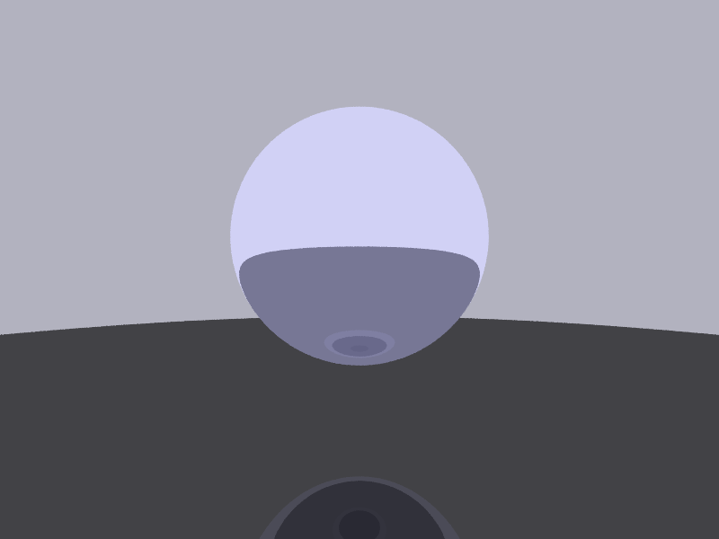 + 
`(30)`
|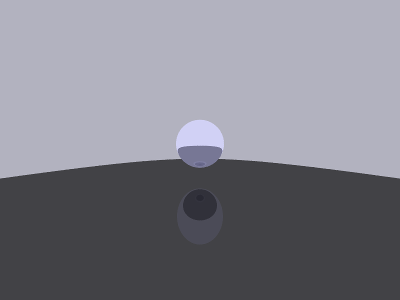 + 
`(60)`
|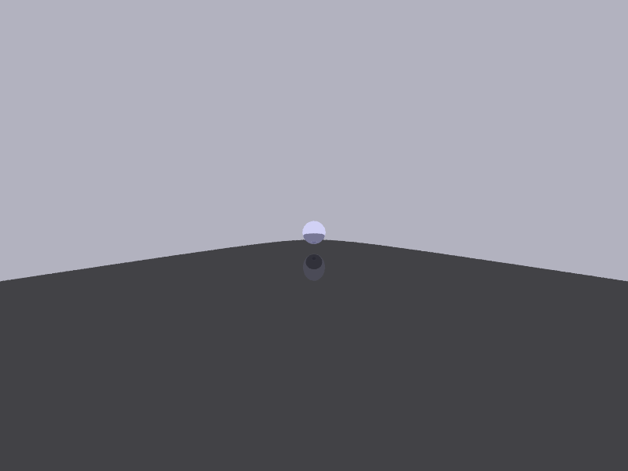 + 
`(80)`
|===

=== Lighting 

==== Ambient Lighting

[#ambient-light]
----
ambient_light: r g b
----

The ambient light color (specified by `ambient_light` in the scene file) is multiplied component-wise with each material's ambient coefficients `(ar, ag, ab)` to initialize the base illumination for every surface point, providing constant lighting independent of geometry or light positions. 
// (lines 382-384).

.Varying `ambient_light` with (r, g, b) listed
[cols="^1,^1,^1,^1"]
|===
|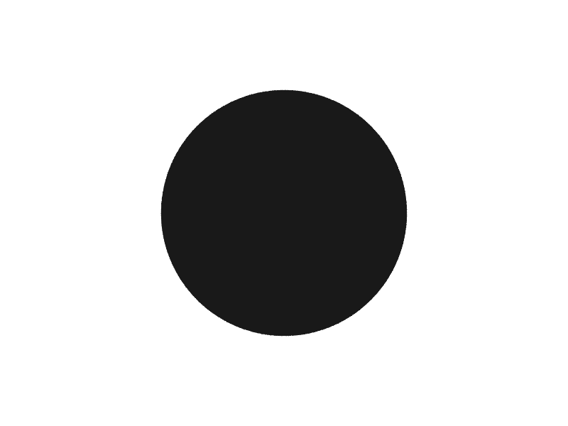 + 
`ambient_sphere.txt`
|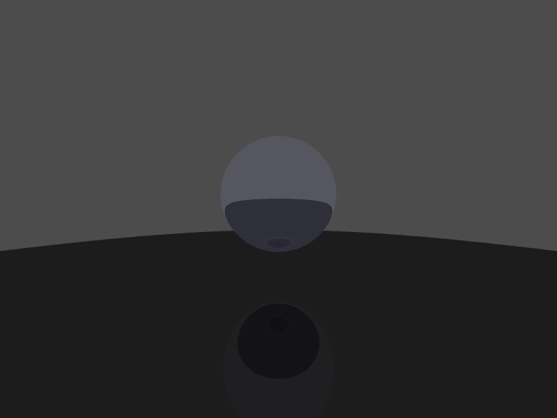 + 
`(0.2,0.2,0.2)`
|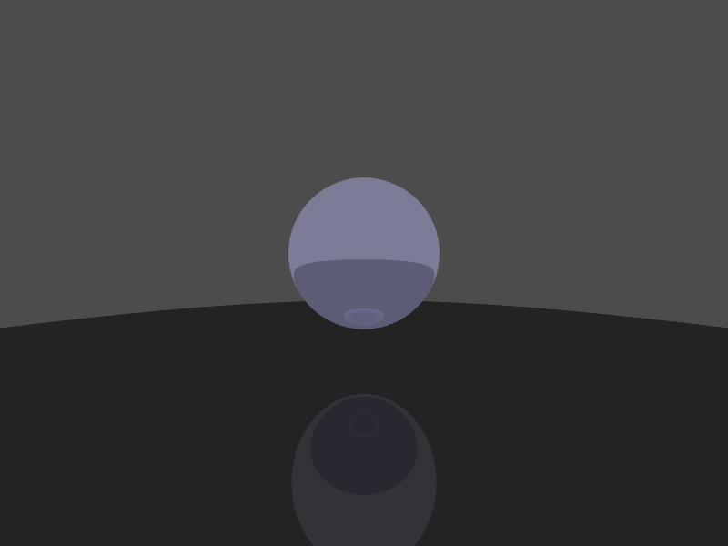 + 
`(0.5,0.5,0.5)`
|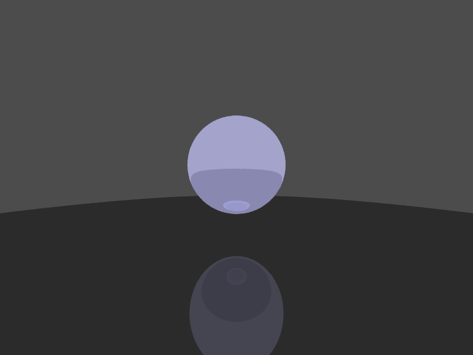 + 
`(0.8,0.8,0.8)`
|===

Ambient lighting provides a simple approximation of global illumination by applying a uniform light contribution to all surfaces in the scene. The ambient contribution is computed by multiplying the global ambient light color by each surface's material ambient color, ensuring that shadowed areas are never completely black and providing realistic fill light throughout the scene. This technique is computationally efficient and effective for simulating light that has scattered multiple times throughout the environment, preventing harsh contrast between lit and shadowed regions.

==== Point, Directional, and Spot lights

[#point-lights]
----
point_light: r g b  x y z
----
The raytracer implements both point lights and directional lights with physically accurate lighting models. Point lights are positioned at specific 3D locations and use inverse-square falloff (1/distance²) to simulate realistic light attenuation, making them ideal for localized light sources like lamps or torches. 

[#directional-lights]
----
directional_light: r g b  x y z
----
Directional lights, on the other hand, are defined by a direction vector and have no distance-based attenuation, simulating infinitely distant light sources like the sun with parallel light rays. Both light types support full Phong shading with diffuse and specular components, and both cast shadows by tracing shadow rays to test for occlusion from other objects in the scene.

[#spot-lights]
----
spot_light: r g b  x y z  dx dy dz  angle1 angle2
----

Spot lights extend the point light model with directional constraints, creating cone-shaped illumination patterns defined by an inner and outer angle. Light intensity smoothly transitions from full brightness within the inner cone to zero at the outer cone boundary using cosine-based falloff. While the spot light class is implemented in the Lighting.h header, the scene parser support is currently a work in progress.

.Types of lights
[cols="^1,^1,^1"]
|===
|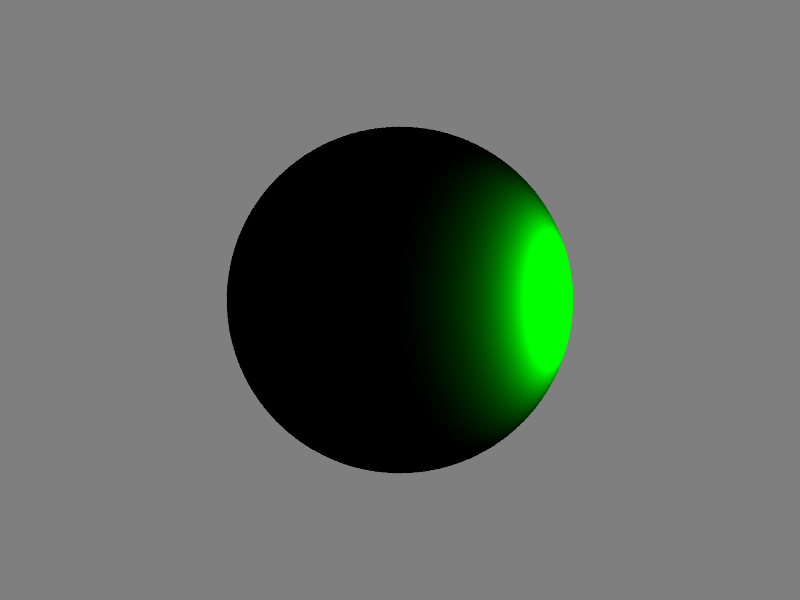 + 
`point_light: 0 .5 0 1 0 1`
|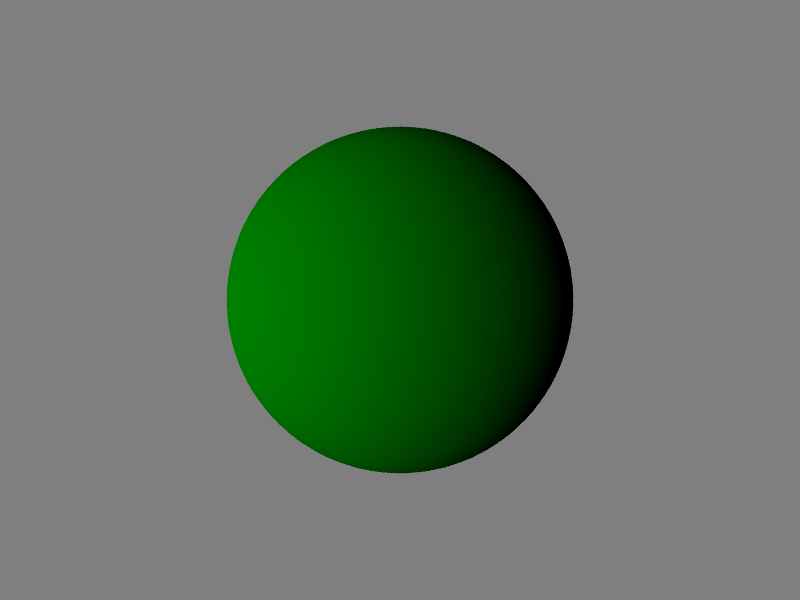 + 
`directional_light: 0 .5 0 1 0 1`
|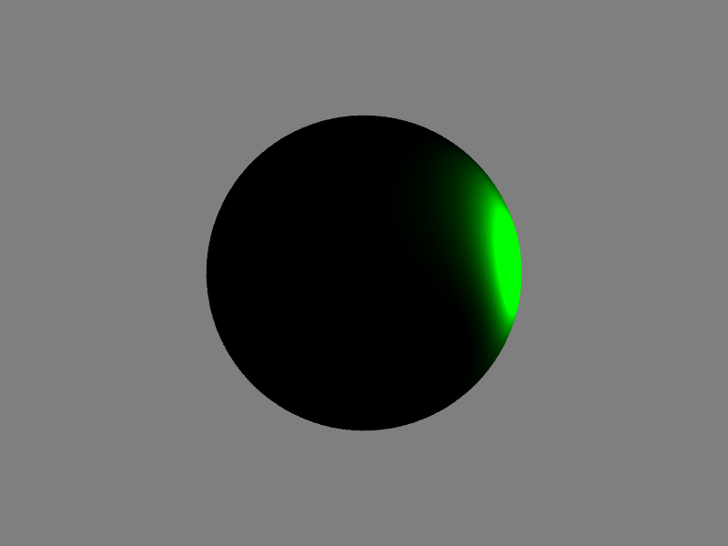 + 
`spot_light: 0 .5 0 1 0 1 0 1 2 45 90`
|===

==== Shadows

[#shadows]
Shadows are computed by casting shadow rays from each surface point toward every light source in the scene before calculating illumination. For point lights, the shadow ray tests for occlusion between the surface and the light position (with distance capped at the light distance), while directional lights use an effectively infinite maximum distance. If any geometry intersects the shadow ray before reaching the light, that light's contribution is skipped for that surface point, creating hard shadows with crisp edges.

.Examples showing shadows
[cols="^1,^1"]
|===
|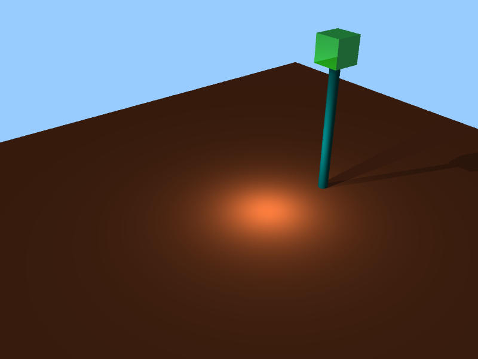 
|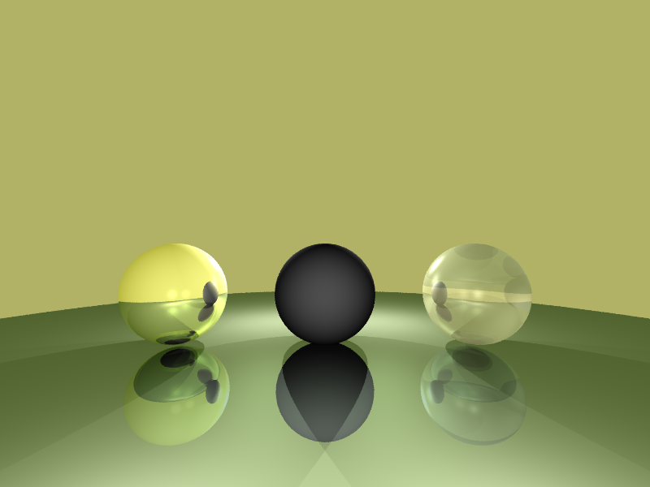
|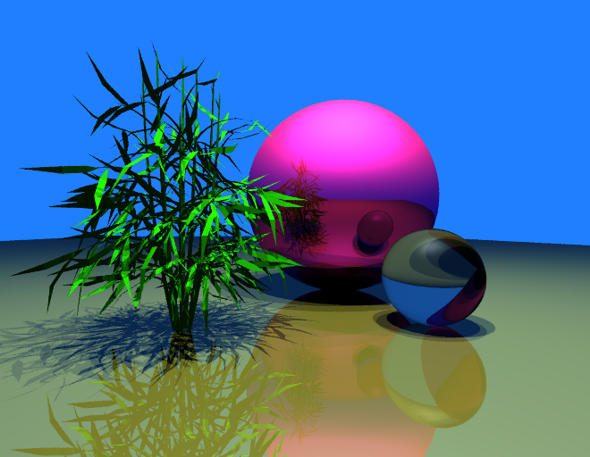
|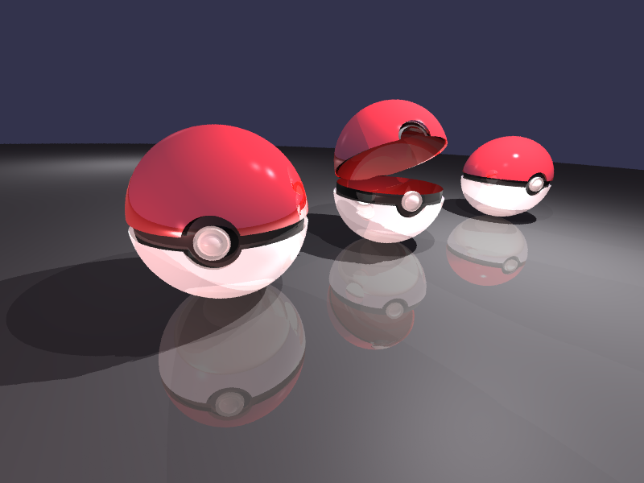
|===
==== Reflection

[#reflections]
Reflections are computed recursively by casting reflected rays from surface intersection points in the mirror direction determined by the surface normal. The reflection direction is calculated using the formula stem:[\vec{r} = \vec{d} - 2(\vec{d} \cdot \vec{n})\vec{n}], where stem:[\vec{d}] is the incident ray direction and stem:[\vec{n}] is the surface normal. The reflected ray's color contribution is weighted by the material's specular coefficient and added to the surface shading, with recursion continuing until the maximum ray depth is reached or the energy contribution becomes negligible.

.Examples showing reflections
[cols="^1,^1"]
|===
|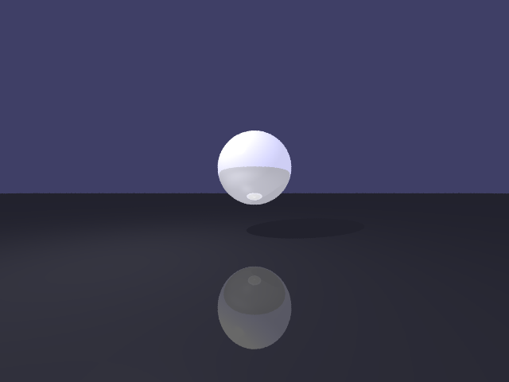
|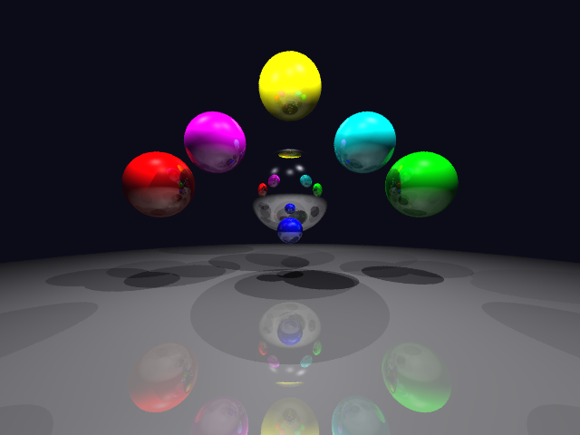
|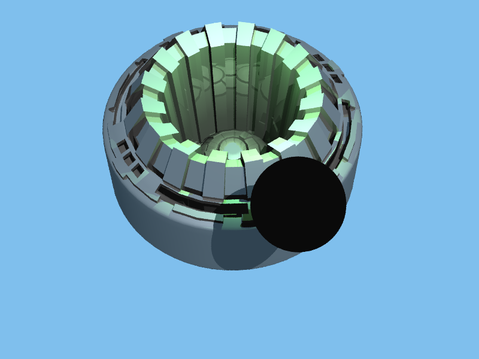
|
// |
|===

==== Refraction

[#refractions]
Refraction is implemented using Snell's law to compute transmitted ray directions when light passes between materials with different indices of refraction (IOR). The refracted direction is calculated as stem:[\vec{t} = \eta\vec{d} + (\eta c_1 - c_2)\vec{n}], where stem:[\eta = n_1/n_2] is the ratio of refractive indices, stem:[c_1 = -\vec{d} \cdot \vec{n}], and stem:[c_2 = \sqrt{1 - \eta^2(1-c_1^2)}]. Fresnel equations determine the blend between reflection and refraction contributions based on viewing angle, creating physically accurate glass and transparent materials. When total internal reflection occurs (when stem:[c_2] becomes imaginary), only the reflected component is computed.

Beer Lambert Law is not currently implemented for absorption within transmissive materials.

.Examples showing refractions
[cols="^1,^1"]
|===
|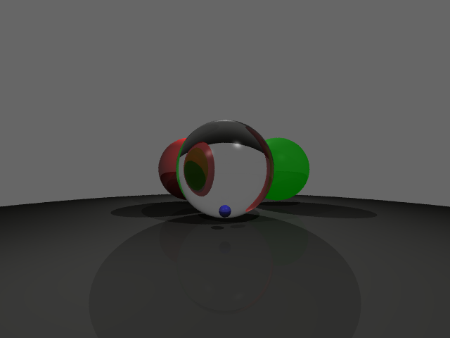
|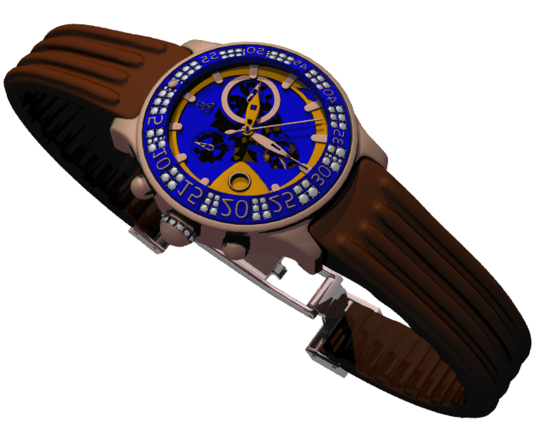
// |
// |
|
// |
|===

=== Scene

==== Colors and Background

[#background-colors]
----
background: r g b
----

Colors in the raytracer are represented as floating-point RGB triplets and are clamped to the [0,1] range before being converted to 8-bit values for output. The background color is specified in the scene file using the `background` command and is returned when a ray fails to intersect any geometry in the scene. Color interpolation is performed linearly during operations like material blending and multi-sample anti-aliasing, ensuring smooth gradients and transitions throughout the rendered image.

.Varying `background` with (r, g, b) listed
[cols="^1,^1,^1,^1"]
|===
|image:Images/spheres_triangles_backgrounds/background/background_grey.png[backgroundGrey] + 
`(0.3,0.3,0.3)`
|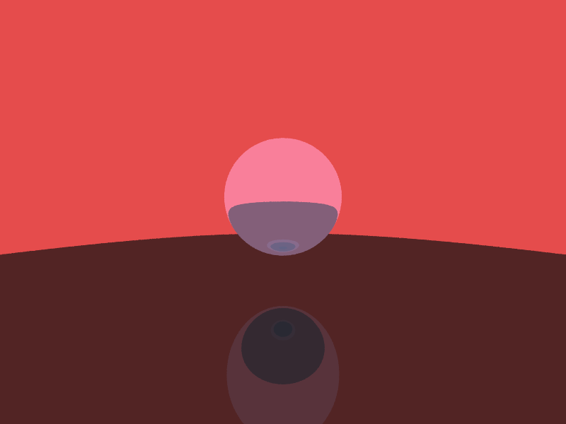 + 
`(0.9,0.3,0.3)`
|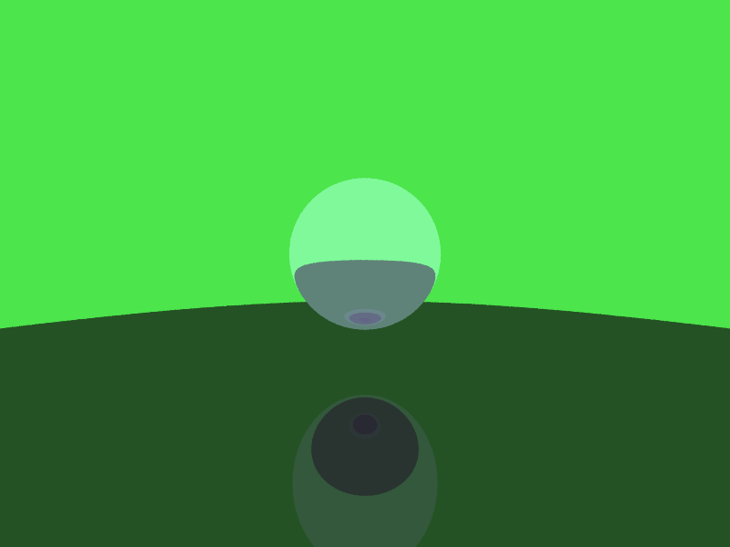 + 
`(0.3,0.9,0.3)`
| + 
`(0.3,0.3,0.9)`
|===

==== Materials

[#materials]
----
material: ar ag ab  dr dg db  sr sg sb  ns  tr tg tb  ior
----

Materials define how surfaces interact with light through four color components: ambient (ar,ag,ab), diffuse (dr,dg,db), specular (sr,sg,sb), and transmissive (tr,tg,tb), along with a Phong exponent (ns) and index of refraction (ior). The final visible color at each surface point is computed by combining the ambient contribution, diffuse lighting from all visible lights, specular highlights, and optionally reflected/refracted light from recursive ray tracing. Each material component is multiplied with the corresponding light contribution and summed to produce the final pixel color, which is then clamped and tone-mapped for display.

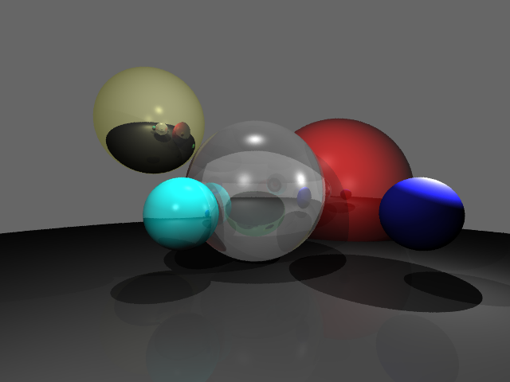

----
# Glass sphere in the center
material: 0.2 0.2 0.2 0.2 0.2 0.2 0.7 0.7 0.7 50 1 1 1 1.3
sphere: 0 0 4 1
# Cyan metallic sphere with high diffuse
material: 0.3 0.3 0.3 0 1 1 0.4 0.4 0.4 80 0 0 0 1
sphere: -0.8 -0.25 3 0.4
# Dark blue sphere diffuse but not transmissive
material: 0.3 0.3 0.6 0.1 0.1 0.6 0 0 0 80 0 0 0 1
sphere: 1.8 -0.25 3 0.4
# Red metallic sphere, low diffuse, small transmissive
material: 0.1 0 0 0.9 0.1 0.1 0.3 0.3 0.3 30 0 0 0 1
sphere: 2 0 7 1.8
# Green sphere behind glass to show refraction
material: 0.0 0.7 0.0 0 1 1 0.4 0.7 0.4 80 0 0 0 1
sphere: 0 0.3 10 0.3
# Yellow mirror sphere, high diffuse and transmissive
material: 0.6 0.6 0 0.6 0.6 0.6 1 1 0.6 100 0 0 0 1 0.9
sphere: -3 2 8 1.5
----

We see clear specular reflections on the yellow mirror sphere and the cyan sphere. We see clear diffuse shading on the dark blue sphere. We can see the power attenuation through the transmissive components on the glass sphere and the green sphere behind it. We see the color blending in the yellow mirror sphere with the red sphere reflection.

===== Phong lighting model

The Phong lighting model is used to compute local illumination at each surface point by summing ambient, diffuse, and specular components. The diffuse term uses Lambert's cosine law stem:[I_d = k_d(\vec{L} \cdot \vec{N})] where stem:[\vec{L}] is the light direction and stem:[\vec{N}] is the surface normal. The specular term uses the Phong reflection model stem:[I_s = k_s(\vec{R} \cdot \vec{V})^{n_s}] where stem:[\vec{R}] is the reflected light direction, stem:[\vec{V}] is the view direction, and stem:[n_s] controls highlight sharpness; we compute stem:[\vec{R}] by reflecting the light direction around the normal rather than using the half-vector (Blinn-Phong) approximation.

===== Diffuse lighting

[#diffuse-lighting]
Diffuse lighting simulates matte surface reflection using Lambertian shading, where surface brightness is proportional to the cosine of the angle between the surface normal and light direction. For each light source, the diffuse contribution is calculated as stem:[C_d = I_{light} \cdot k_d \cdot \max(0, \vec{N} \cdot \vec{L})] where stem:[I_{light}] is the light intensity, stem:[k_d] is the material diffuse color, stem:[\vec{N}] is the surface normal, and stem:[\vec{L}] is the light direction. The max() function ensures that surfaces facing away from lights receive no diffuse contribution, and distance attenuation is applied for point lights.

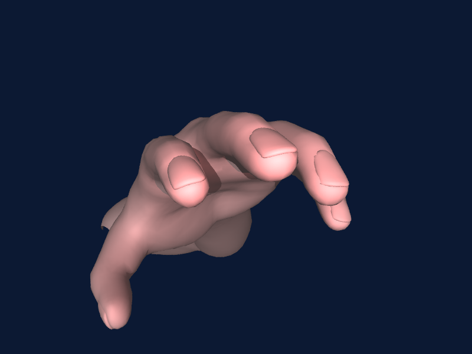

===== Specular lighting

[#specular-lighting]
Specular lighting creates glossy highlights that vary based on viewing angle, simulating mirror-like reflections from smooth surfaces. The specular component is computed using the Phong model stem:[C_s = I_{light} \cdot k_s \cdot (\vec{R} \cdot \vec{V})^{n_s}] where stem:[k_s] is the material specular color, stem:[\vec{R}] is the reflected light direction, stem:[\vec{V}] is the view direction, and stem:[n_s] is the Phong exponent controlling highlight size. Higher exponents create tighter, shinier highlights, while lower values produce broader, more matte reflections; specular highlights only appear when viewing the surface from angles close to the perfect mirror reflection direction.

==== Geometries

===== Spheres

[#spheres]
----
sphere: x y z radius
----

Spheres are defined by a center point (x,y,z) and radius, with ray intersection computed analytically using the quadratic formula. The ray-sphere intersection finds parameter t where stem:[||\vec{O} + t\vec{D} - \vec{C}||^2 = r^2], which expands to stem:[at^2 + bt + c = 0] where stem:[a = \vec{D} \cdot \vec{D}], stem:[b = 2\vec{D} \cdot (\vec{O} - \vec{C})], and stem:[c = ||\vec{O} - \vec{C}||^2 - r^2]. The surface normal at any point is computed as stem:[\vec{N} = (\vec{P} - \vec{C})/r], always pointing radially outward from the sphere center, enabling accurate shading and reflection calculations.

.Examples with spheres
[cols="^1,^1"]
|===
|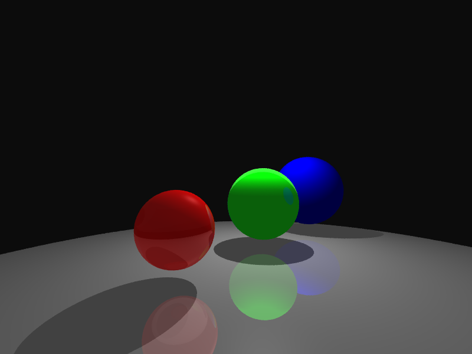 + 
`sphere1`
|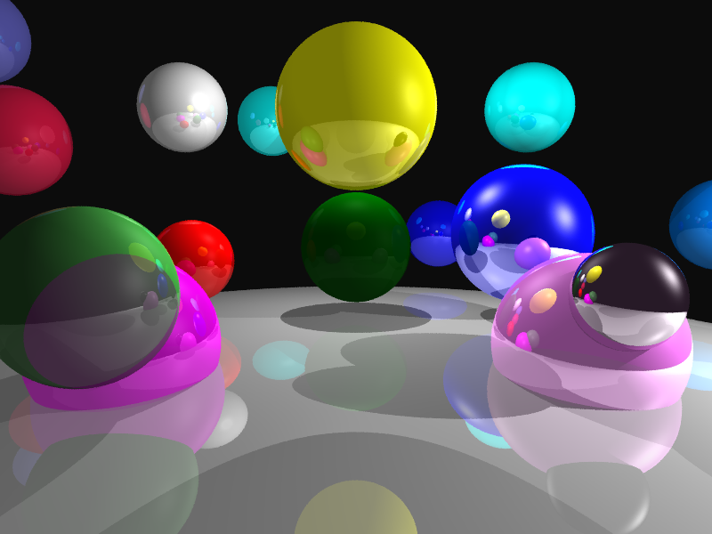 + 
`sphere2`
|===

===== Triangles

[#triangles]
----
vertex: x y z
triangle: v0 v1 v2
----

Triangles without vertex normals use the Möller-Trumbore intersection algorithm for efficient ray-triangle intersection testing. The algorithm computes barycentric coordinates stem:[(u, v)] and intersection distance stem:[t] directly without explicitly computing the plane equation, using the formula stem:[\vec{O} + t\vec{D} = (1-u-v)\vec{V}_0 + u\vec{V}_1 + v\vec{V}_2]. The triangle's surface normal is computed as stem:[\vec{N} = (\vec{V}_1 - \vec{V}_0) \times (\vec{V}_2 - \vec{V}_0)] and remains constant across the entire triangle surface, creating flat shading.

[#triangles-with-normals]
----
normal: nx ny nz
normal_triangle: v0 v1 v2  n0 n1 n2
----

Triangles with vertex normals extend the basic triangle by interpolating normals across the surface using barycentric coordinates for smooth shading. At the intersection point with barycentric coordinates stem:[(u, v)], the shading normal is computed as stem:[\vec{N} = (1-u-v)\vec{N}_0 + u\vec{N}_1 + v\vec{N}_2] and then normalized. This allows triangle meshes to approximate curved surfaces by smoothly varying the normal across faces, producing much more realistic shading than flat-shaded triangles while maintaining the same geometric representation.

===== Constructive Solid Geometry

[#csg]
----
sphere: x y z radius           # Define component spheres
csg_union: base_idx op1 op2... # Combine with union
csg_difference: base_idx op1...# Subtract operands
csg_intersection: base_idx op1...# Keep only overlap
----

Constructive Solid Geometry (CSG) allows complex shapes to be built by combining primitive spheres using boolean operations, enabling the creation of sophisticated models like gears, mechanical parts, and architectural elements from simple building blocks. CSG objects are represented by a base sphere and one or more operand spheres, with the operation type (union, difference, or intersection) determining how they combine to form the final shape. The implementation follows an interval-based approach: ray intersection with CSG objects requires finding all entry/exit points (t-values) with component spheres, constructing intervals where the ray is inside each sphere, and then combining these intervals according to the CSG operation to determine the final surface boundaries.

Our CSG implementation is defined in `Geometries.h` using the `CSGObject` class, which stores the operation type, base sphere, and a vector of operand spheres. The scene parser allows users to first define individual spheres using standard `sphere:` commands, then reference them by index in CSG commands. For example, defining `sphere: 0 0 0 1.0` followed by `sphere: 0.5 0 0 0.6` creates two spheres at indices 0 and 1; the command `csg_difference: 0 1` then creates a CSG object where sphere 1 is carved out of sphere 0, producing a spherical cavity.

The CSG intersection algorithm in `RayInteractions.h:intersectCSG()` handles each operation type differently:

[#csg-union]
**Union operations** combine multiple spheres into a single object by taking the closest intersection among all components, effectively creating a merged shape where any point inside at least one component sphere is considered inside the CSG object. When a ray intersects a CSG union, the raytracer tests the ray against the base sphere and all operand spheres using standard ray-sphere intersection, collecting all intersection points and selecting the one with the smallest positive t value (closest to the camera). The surface normal at the intersection point is taken from whichever component sphere was actually hit, ensuring proper shading at the boundaries between merged primitives. This is the simplest CSG operation computationally, as it requires only finding the minimum t value among all hits, with no complex interval arithmetic. Union operations are useful for modeling organic forms, collections of objects treated as a single entity, or quick approximations of smooth blending between shapes.

[#csg-difference]
**Difference operations** carve away operand spheres from a base sphere, creating hollow or sculpted shapes by subtracting volumes from the base geometry. The ray intersection algorithm computes entry/exit intervals for both the base and all operand spheres, using interval arithmetic to construct the final surface: for each operand sphere, we compute where the ray enters (t_enter) and exits (t_exit) that sphere, then remove these intervals from the base sphere's intervals to determine where the ray is inside the base but outside all operands. When a ray enters an operand sphere while inside the base (entering a carved-out cavity), the operand's inward-facing surface becomes the new boundary, with its normal flipped to point into the cavity for proper lighting. This creates the distinctive "hollowed out" appearance where you can see inside the removed volume.

The algorithm works by first finding the base sphere's entry and exit points, then iterating through each operand sphere to find subtractive intervals. If the ray enters an operand while inside the base (t_enter_operand is between t_enter_base and t_exit_base), we create a hit at t_enter_operand with the operand's inward normal (flipped). Similarly, if the ray exits an operand while inside the base, the surface continues from that point. This allows complex carved shapes like Swiss cheese, mechanical parts with holes, or architectural elements with doorways and windows. The challenge is handling overlapping operands correctly and ensuring the closest valid surface point is returned.

[#csg-intersect]
**Intersection operations** keep only the region where all component spheres overlap, creating the common volume shared by all primitives—essentially the "AND" operation in boolean logic. The ray intersection finds overlapping t-intervals by computing the maximum entry point (last sphere the ray enters) and minimum exit point (first sphere the ray exits) among all spheres. Only if the maximum entry is less than the minimum exit does a valid intersection exist, indicating the ray passes through a region inside all spheres simultaneously. The surface normal is taken from the sphere providing the maximum entry point (the last sphere the ray enters), as this sphere defines the visible boundary of the intersection volume.

Algorithmically, intersection CSG works by finding all t_enter and t_exit values for the base and operand spheres, then computing stem:[t_{enter,final} = \max(t_{enter,base}, t_{enter,op1}, t_{enter,op2}, ...)] and stem:[t_{exit,final} = \min(t_{exit,base}, t_{exit,op1}, t_{exit,op2}, ...)]. If stem:[t_{enter,final} < t_{exit,final}] and both are positive, the ray intersects the CSG object at stem:[t_{enter,final}]. This operation is useful for creating complex shapes by constraining geometry to specific regions, such as a sphere clipped by planes (using sphere-sphere intersection to approximate planes) or creating precise geometric constructions like geodesic domes or molecular models where atoms overlap at specific bonding sites.

===== Implicit Surfaces

[#implicit-surfaces]
----
# Basic SDF primitives
sdf_sphere: x y z radius
sdf_box: x y z half_x half_y half_z
sdf_plane_oriented: vertex_idx normal_idx
sdf_torus: x y z major_radius minor_radius
sdf_cylinder: x y z radius
sdf_capped_cylinder: x y z radius half_height

# Oriented SDF primitives (using vertex/normal pools)
sdf_plane_oriented: vertex_idx normal_idx
sdf_quad_oriented: vertex_idx half_width half_height normal_idx
sdf_box_oriented: vertex_idx hx hy hz normal_idx
sdf_torus_oriented: vertex_idx major minor normal_idx
sdf_cylinder_oriented: vertex_idx radius normal_idx
sdf_capped_cylinder_oriented: vertex_idx radius half_height normal_idx

# Fractal SDFs
sdf_mandelbulb: x y z iterations power
sdf_mandelbox: x y z iterations scale
sdf_menger_sponge: x y z iterations

# SDF boolean operations
sdf_union: base_idx operand1 operand2...
sdf_intersection: base_idx operand1 operand2...
sdf_difference: base_idx operand1 operand2...

sdf_smooth_union: smoothing_factor base_idx operand1 operand2...
sdf_smooth_intersection: smoothing_factor base_idx operand1 operand2...
sdf_smooth_difference: smoothing_factor base_idx operand1 operand2...
----

Implicit surfaces represent one of the most powerful and flexible approaches to geometric modeling in computer graphics, defining shapes mathematically through signed distance functions (SDFs) that return the distance from any point in space to the nearest surface. The "signed" aspect is crucial: the function returns positive values for points outside the shape, negative values for points inside, and exactly zero on the surface boundary. This mathematical representation enables several key advantages over explicit geometry:

1. **Infinite detail**: SDFs are resolution-independent—zooming in arbitrarily close to the surface never reveals polygonal facets or discretization artifacts.

2. **Complex shapes**: Fractals, organic forms, and mathematical surfaces (like Mandelbulb or Mandelbox) can be expressed compactly as formulas rather than massive polygon meshes.

3. **Smooth boolean operations**: Unlike CSG on explicit geometry, SDF-based boolean operations can use smooth minimum/maximum functions to create organic blending between shapes.

4. **Efficient transformations**: Translation, rotation, and scaling of SDFs can often be implemented by transforming the query point rather than the geometry itself.

Our implementation in `SDF.h` defines an abstract `SDF` base class with a pure virtual `evaluate(Point3D p)` method that returns the signed distance at any point. Derived classes implement specific primitives:

**Basic SDF Primitives:**

- **SDFSphere**: stem:[d(\vec{p}) = ||\vec{p} - \vec{c}|| - r] where stem:[\vec{c}] is the center and stem:[r] is the radius. This is the simplest SDF, computing Euclidean distance to the sphere center and subtracting the radius.

- **SDFBox**: Uses the formula stem:[d(\vec{p}) = ||\max(\vec{q}, \vec{0})|| + \min(\max(q_x, q_y, q_z), 0)] where stem:[\vec{q} = |\vec{p}| - \vec{h}] and stem:[\vec{h}] is the half-extent vector. This elegantly handles both interior and exterior distances.

- **SDFPlane**: stem:[d(\vec{p}) = \vec{n} \cdot \vec{p} - d_0] where stem:[\vec{n}] is the unit normal and stem:[d_0] is the signed distance from the origin. Infinite planes are trivial in SDF form but complex in explicit geometry.

- **SDFTorus**: Computed as stem:[d(\vec{p}) = \sqrt{(\sqrt{x^2 + z^2} - R)^2 + y^2} - r] where stem:[R] is the major radius and stem:[r] is the minor (tube) radius. The formula works by first projecting to the ring in the XZ plane, then computing distance to the circular cross-section.

**Oriented SDF Variants:**

Many SDF primitives have "oriented" variants that support arbitrary rotations specified through normal vectors from the scene's vertex/normal pools. For example, `sdf_plane_oriented` uses a vertex index to define a point on the plane and a normal index for orientation, computing the distance as stem:[d = (\vec{p} - \vec{p}_0) \cdot \vec{n}]. These oriented primitives use rotation matrices internally to transform query points into the primitive's local coordinate system, evaluate the canonical SDF, and then transform results back to world space.

The oriented variants are particularly useful for:
- Creating architectural scenes with walls at arbitrary angles
- Defining complex mechanical parts with specific orientations
- Building procedural scenes where orientation is computed algorithmically
- Ensuring consistency with the vertex/normal pool system used for triangles

.Examples of oriented SDF primitives
[cols="^1,^1,^1"]
|===
| 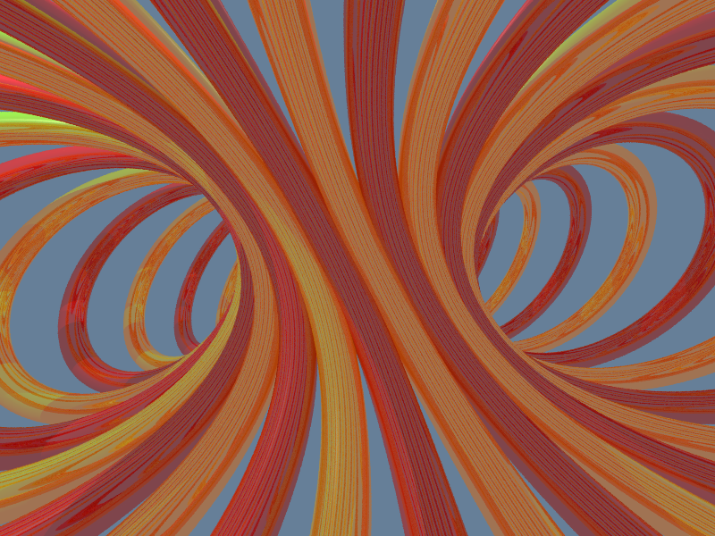 + 
`sdf_mandelbulb: 0 0 0 7 6`
| 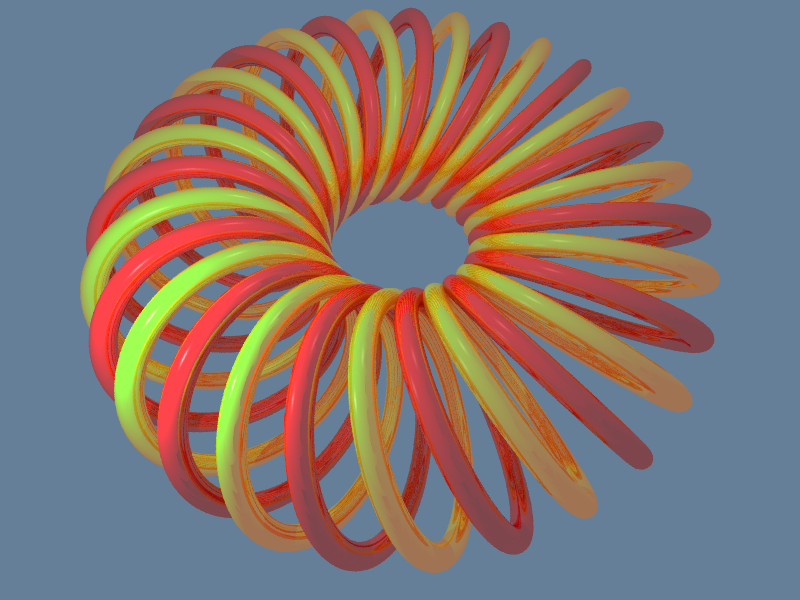 + 
`sdf_mandelbox: 0 0 0 5 2`
| 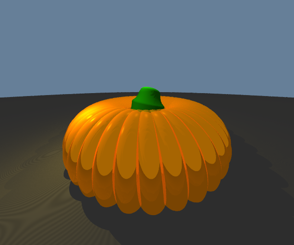 + 
`sdf_menger_sponge: 0 0 0 4`
|===

**Fractal SDFs:**

.Examples of fractal SDFs
[cols="^1,^1,^1"]
|===
| 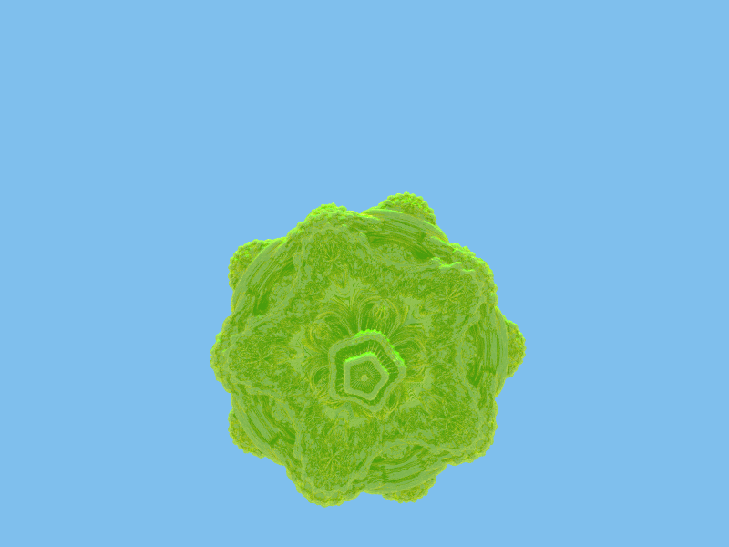 + 
`sdf_mandelbulb: 0 0 0 7 6`
| 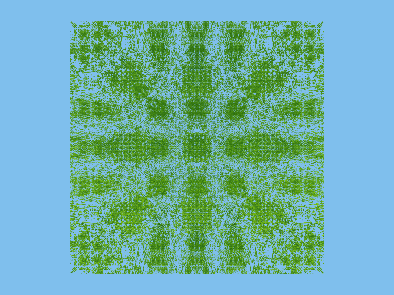 + 
`sdf_mandelbox: 0 0 0 5 2`
| 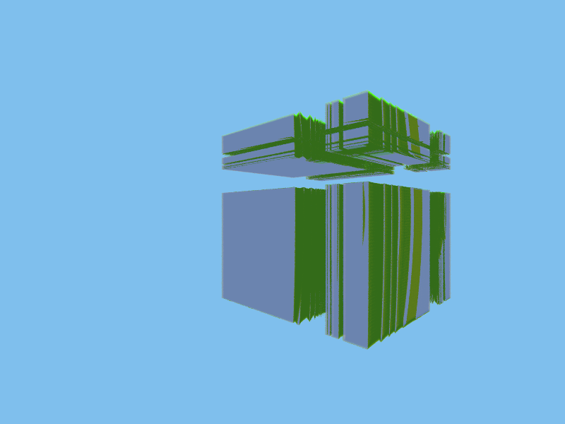 + 
`sdf_menger_sponge: 0 0 0 4`
|===

Fractals represent some of the most visually stunning applications of SDF rendering, creating infinitely detailed structures through iterative point transformations:

- **Mandelbulb**: A 3D generalization of the Mandelbrot set using spherical coordinates. The SDF is computed by iterating stem:[\vec{z} \leftarrow \vec{z}^n + \vec{c}] in polar form, tracking both the escape distance and derivative magnitude to compute the distance estimate stem:[d \approx \frac{1}{2} \log(r) \cdot \frac{r}{dr}].

- **Mandelbox**: Uses "box folding" and "sphere folding" operations iteratively, creating cube-like structures at multiple scales. The algorithm folds coordinates greater than 1.0, applies spherical inversions for points inside a fixed radius, then scales and translates.

- **Menger Sponge**: A recursive cube-based fractal that subdivides and removes cross-shaped sections at each iteration level, creating a sponge-like structure with fractal dimension ≈ 2.727.

These fractals are expensive to render (requiring 8-20 SDF evaluations per iteration, times multiple marching steps), but produce results impossible to achieve with traditional polygon modeling.

**SDF Boolean Operations:**

Boolean operations on SDFs are implemented through simple arithmetic on distance values:

- **Union**: stem:[d_{union}(\vec{p}) = \min(d_1(\vec{p}), d_2(\vec{p}))] — take the minimum distance to either surface
- **Intersection**: stem:[d_{intersect}(\vec{p}) = \max(d_1(\vec{p}), d_2(\vec{p}))] — take the maximum distance (both must be satisfied)
- **Difference**: stem:[d_{diff}(\vec{p}) = \max(d_1(\vec{p}), -d_2(\vec{p}))] — subtract by negating the second field

These operations combine instantly at render time (unlike polygon CSG which requires complex mesh operations), and can be enhanced with smooth minimum/maximum functions for organic blending: stem:[smin(a,b,k) = \min(a,b) - \frac{h^2}{4k}] where stem:[h = \max(k - |a-b|, 0)].

**SDF Transformation Wrapper:**

The `SDFTransform` class wraps any SDF primitive with a translation offset, evaluating stem:[d(\vec{p}) = d_{child}(\vec{p} - \vec{t})] where stem:[\vec{t}] is the translation vector. This allows primitives defined at the origin to be positioned anywhere in the scene without modifying their evaluation functions. More complex transformations (rotation, scale, shear) could be added by transforming the query point through the inverse transformation matrix before evaluation.

[#ray-marching]
**Ray Marching (Sphere Tracing) Algorithm:**

Ray marching is the rendering technique used to find intersections between rays and implicit surfaces, differing fundamentally from the analytical intersection tests used for spheres and triangles. The algorithm exploits the Lipschitz continuity property of SDFs: the distance returned at any point is guaranteed to be a safe lower bound on how far we can move in any direction without missing the surface.

The sphere tracing algorithm in `SDF.h:rayMarch()` proceeds as follows:

1. **Initialize**: Start at the ray origin plus a small offset (stem:[t_0] = 0.01) to avoid self-intersection on secondary rays. The offset prevents numerical issues where a reflected ray immediately re-intersects the surface it originated from.

2. **March loop**: For each iteration (maximum 128 steps):
   - Compute current position: stem:[\vec{p} = \vec{o} + t \cdot \vec{d}] where stem:[\vec{o}] is ray origin, stem:[\vec{d}] is direction, stem:[t] is accumulated distance
   - Evaluate SDF: stem:[dist = sdf.evaluate(\vec{p})]
   - **Hit test**: If stem:[dist < \epsilon] (epsilon = 0.003), we've found the surface
   - **Distance test**: If stem:[t > d_{max}] (max = 100.0), the ray escaped the scene
   - **Step forward**: stem:[t \leftarrow t + \max(dist, \epsilon_{min})] where stem:[\epsilon_{min}] = 0.001 prevents infinite loops in degenerate cases

3. **Normal computation**: Upon hitting the surface, compute the gradient of the SDF using the tetrahedron technique, which evaluates the SDF at four points arranged in a tetrahedron around the hit point. This requires only 4 SDF evaluations compared to 6 for central differences, using the formula:
+
[stem]
++++
\vec{n} = \text{normalize}\begin{pmatrix}
  sdf(\vec{p} + \vec{k}_1) - sdf(\vec{p} - \vec{k}_1) \\
  sdf(\vec{p} + \vec{k}_2) - sdf(\vec{p} - \vec{k}_2) \\
  sdf(\vec{p} + \vec{k}_3) - sdf(\vec{p} - \vec{k}_3)
\end{pmatrix}
++++
+
where stem:[\vec{k}_i] are offset vectors arranged tetrahedrally with magnitude stem:[\delta] (0.002).

**Performance Optimizations:**

Several optimizations make ray marching practical for interactive rendering:

- **Adaptive epsilon**: The surface threshold epsilon is set relatively large (0.003) compared to geometric precision, trading perfect accuracy for 2-3× fewer steps.

- **Early termination**: Rays that escape beyond 50 units after 10 steps are immediately culled, assuming they'll never hit anything.

- **Minimum step size**: Even when the SDF returns very small values, we advance by at least stem:[\epsilon_{min}] = 0.001 to prevent getting stuck in nearly-flat regions.

- **Bounding box culling**: Each `SDFObject` caches a conservative AABB of its SDF's bounds, allowing the BVH to skip entire SDF evaluations for rays that can't possibly hit.

- **Reduced step count**: Maximum steps are capped at 128 (compared to 256-512 in production renderers) to prioritize rendering speed over perfect convergence.

**Integration with Raytracer:**

SDF objects integrate seamlessly with the existing raytracer infrastructure through the `SDFObject` geometry type in `Geometries.h`. Each `SDFObject` stores:
- A shared pointer to the root SDF (which may be a composite of transforms, booleans, and primitives)
- A material definition (same as other geometry types)
- Cached bounding box for BVH acceleration
- A flag (`useTriplanar`) indicating whether to use triplanar UV mapping for textures

When a ray intersects an `SDFObject`, the `intersectSDF()` function in `RayInteractions.h` calls `rayMarch()` with the SDF's root node, converting the returned `RayMarchResult` (containing hit point, normal, and t-value) into a standard `HitRecord` for shading. This uniform interface allows SDFs to participate in all rendering features: shadows, reflections, refractions, texturing, and acceleration structures work identically whether the underlying geometry is explicit or implicit.

The main performance trade-off is that ray-marched SDFs require 50-128 function evaluations per ray (versus 1 evaluation for analytical primitives), making them 10-50× slower per intersection test. However, for shapes that would require millions of triangles to approximate (fractals, smooth CSG), SDFs remain the only practical option.

==== Textures

[#procedural-texturing]
----
diffuse_texture: checker  r1 g1 b1  r2 g2 b2  scale
diffuse_texture: checker3d  r1 g1 b1  r2 g2 b2  scale
diffuse_texture: wood     r1 g1 b1  r2 g2 b2  scale turbulence
diffuse_texture: marble   r1 g1 b1  r2 g2 b2  scale
diffuse_texture: image    filename.png
----

Procedural texturing generates surface colors algorithmically rather than from image data, including 2D checkerboard patterns, 3D volumetric checkers, wood grain using turbulent noise, and marble patterns with Perlin noise. Textures can be applied to diffuse, specular, and normal map channels of materials, with UV coordinates computed from sphere parameterization for spheres and barycentric interpolation for triangles. For SDF objects without natural UV coordinates, triplanar mapping projects the texture from three orthogonal directions and blends based on surface normal, ensuring seamless coverage on arbitrary implicit surfaces without distortion. 

=== Optimization

==== Sampling

----
# Configured in raytracer.cpp: samplesPerPixel = 8
----

Anti-aliasing is achieved through stochastic supersampling, casting multiple rays per pixel with randomized offsets sampled from a Gaussian distribution (σ=0.3, clamped to ±0.5 pixels). For each pixel, 8 rays are cast with slightly different directions computed by perturbing the pixel center coordinates, and the resulting colors are averaged to produce the final pixel value. This technique effectively reduces jagged edges (aliasing artifacts) along geometric boundaries and produces softer, more photorealistic images compared to single-sample rendering, at the cost of 8× more ray-geometry intersection tests.

==== Recursion

----
max_depth: depth_value
----

Recursive ray tracing is used to compute global illumination effects (reflections, refractions) by spawning secondary rays at surface intersection points up to a maximum depth limit. Each time a ray hits a reflective or transmissive surface, new rays are cast in the mirror and/or refracted directions, with their color contributions weighted by the material's reflective/transmissive coefficients and added to the local shading. The recursion terminates when the ray depth counter reaches `max_depth` or when the accumulated energy falls below a threshold, preventing infinite recursion in scenes with facing mirrors while capturing multiple bounces of light; typical values range from 3-6 depending on scene complexity and desired realism.

==== Parallelization

[#parallelization]
The raytracer uses OpenMP to parallelize the rendering loop across all available CPU cores, distributing pixels among threads with dynamic load balancing. The main pixel iteration loop is parallelized with `#pragma omp parallel for schedule(dynamic, 16)`, where each thread maintains its own random number generator state to avoid contention and ensure reproducible results. Dynamic scheduling with a chunk size of 16 prevents load imbalance caused by varying ray complexity across the image (e.g., some pixels requiring many ray marching steps for SDFs while others hit simple spheres), achieving near-linear speedup; an 8-core system typically renders 7-7.5× faster than single-threaded execution.

==== Acceleration with Bounding Volume Hierarchy

[#bvh]
----
# Automatically enabled by default
accel: bvh  # Can also use: simple, octree, hybrid, none
----

The Bounding Volume Hierarchy (BVH) is a spatial acceleration structure that dramatically improves ray tracing performance by organizing scene geometry into a binary tree of axis-aligned bounding boxes (AABBs), allowing rays to skip testing against large groups of objects through efficient hierarchical culling. Rather than testing every ray against every object in the scene (O(n) complexity per ray), the BVH enables logarithmic-time intersection queries by grouping nearby objects together and testing against progressively smaller bounding volumes. This acceleration structure is particularly effective for scenes with thousands of triangles, complex meshes, or mixed geometry types, providing 10-100× speedup over naive linear intersection testing in typical scenarios.

**BVH Construction Algorithm:**

Our BVH implementation in `BVH.h` uses a top-down recursive construction strategy with surface area heuristic (SAH)-inspired splitting. The construction algorithm begins by computing an AABB for each primitive in the scene (spheres, triangles, CSG objects, and SDF objects all have specialized bounding box computation in `computeAABB()`). The builder then recursively partitions the geometry using the following steps:

1. **Base case**: If the current node contains ≤4 primitives (configurable `maxLeafSize`), create a leaf node storing direct references to those geometries. Leaf nodes perform actual ray-geometry intersection tests when traversed.

2. **Choose split axis**: Compute the bounding box extent in each dimension (X, Y, Z) and select the longest axis for splitting. This heuristic tends to create more balanced trees and better spatial separation than random axis selection.

3. **Sort primitives**: Sort all primitives in the current partition by their centroid coordinate along the chosen axis. This enables efficient median-based splitting without explicitly computing SAH costs.

4. **Split at midpoint**: Divide the sorted primitive list at the median (stem:[mid = start + count/2]), ensuring balanced subtree sizes and O(log n) tree depth.

5. **Recurse**: Recursively build left and right child nodes for the two partitions, propagating the split until all branches terminate in leaf nodes.

The resulting BVH tree structure uses `std::unique_ptr` for memory management, with each internal node storing its bounding box and pointers to left/right children, while leaf nodes store a vector of geometry pointers for intersection testing.

**Ray-BVH Traversal Algorithm:**

Ray traversal through the BVH uses a recursive depth-first search strategy that exploits the hierarchical nature of the structure. The traversal algorithm in `intersectRecursive()` follows these steps:

1. **AABB intersection test**: Before examining a node's contents, test whether the ray intersects the node's bounding box using the slab method. The ray-AABB test computes entry/exit t-values for each axis using stem:[t_{near} = \frac{box_{min,i} - ray_{origin,i}}{ray_{dir,i}}] and stem:[t_{far} = \frac{box_{max,i} - ray_{origin,i}}{ray_{dir,i}}], then checks if the overlapping interval stem:[[\max(t_{near,x}, t_{near,y}, t_{near,z}), \min(t_{far,x}, t_{far,y}, t_{far,z})]] is valid and intersects the ray's positive direction.

2. **Early termination**: If the ray doesn't intersect the node's AABB, or if the intersection is beyond the current closest hit distance, immediately return without examining the node's children. This culling is the key to BVH's performance—large portions of the tree are pruned based solely on bounding box tests.

3. **Leaf node processing**: If the current node is a leaf (detected by checking if the geometry list is non-empty), iterate through all primitives in the leaf and perform actual ray-geometry intersection tests. Update the closest hit record if any intersection is closer than previously found hits.

4. **Internal node traversal**: For internal nodes, recursively traverse both left and right children. The order doesn't matter for correctness, but traversing the nearer child first can provide better early termination in some cases. Our implementation traverses both children and combines results with logical OR, ensuring all potential hits are considered.

5. **Closest hit propagation**: The closest hit distance is maintained across all recursive calls, serving as a dynamic culling threshold. As closer hits are found during traversal, the updated distance allows more aggressive pruning of remaining branches.

**Performance Characteristics:**

The BVH's effectiveness stems from its ability to eliminate large portions of the scene from consideration with simple AABB tests. For a balanced BVH with n primitives:

- **Construction time**: O(n log n) due to sorting at each level
- **Memory**: O(n) for internal nodes + leaf node storage
- **Traversal time**: O(log n) average case for point queries, though pathological cases (long rays passing through many nodes) can approach O(n)
- **Ray coherence**: Primary camera rays exhibit high coherence, often following similar paths through the BVH and benefiting from cache locality

In practice, scenes with 10,000+ triangles see 50-100× speedup, while smaller scenes (100-1000 primitives) see 10-20× improvement. The BVH also benefits all geometry types uniformly—spheres, triangles, CSG objects, and ray-marched SDFs all gain acceleration, with the structure's overhead being minimal (typically <5% of render time for construction).

**BVH Variants:**

Our implementation includes several BVH variants accessible through the scene file `accel:` command:

- **`bvh`**: Full recursive BVH with median splitting (default, best overall performance)
- **`simple`**: Simplified BVH variant (BVH_Simple.h) with different split heuristics
- **`hybrid`**: BVH-Octree hybrid combining spatial and object subdivision for specific scene types
- **`none`**: Disables acceleration for benchmarking (linear intersection testing)

Comparing these variants on complex scenes reveals that the standard BVH typically provides the best balance of construction speed and traversal performance, while the hybrid approach can excel in scenes with both dense meshes and scattered primitives.

==== Acceleration with OctTrees

[#octree]
----
accel: octree  # Alternative spatial subdivision
----

An Octree variant is also implemented as an alternative acceleration structure, recursively subdividing 3D space into eight octants (children) and distributing geometry among cells that overlap the primitives' bounding boxes. Unlike BVH which adapts to geometry distribution, the Octree uses uniform spatial subdivision, making it particularly effective for evenly distributed scenes but potentially less optimal for clustered geometry. The octree implementation shares the same interface as the BVH, allowing direct comparison of performance characteristics; in practice, BVH typically outperforms Octree for most scenes due to better adaptivity, though Octree can be advantageous for spatially coherent ray patterns like camera rays in architectural scenes.

